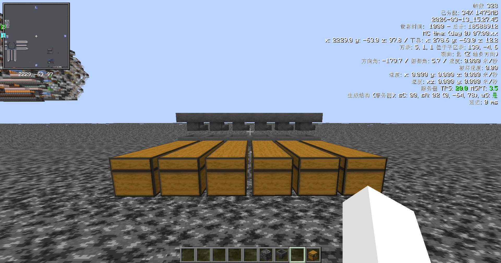
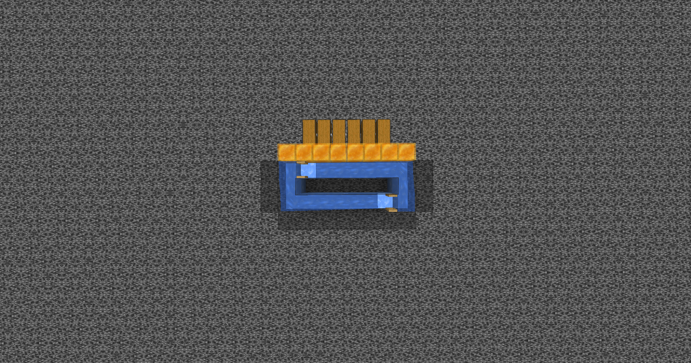
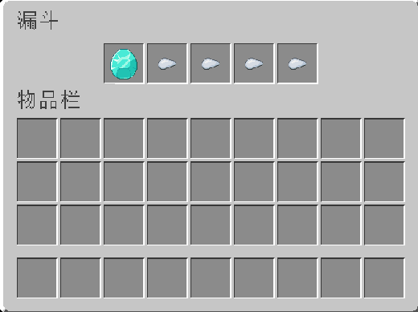

=== 
id: wiki-804672995 
简介: 在正文开始之前，先问屏幕前的各位一个问题：什么是储电？
 
有人认为，这是一个以中学生为主的技术圈子 
也有人认为，它只是生电体系的一个附属分支 

然而无论如何评价，储电发展至今，已经形成了一套独特的研究方向与技术文化。 
标签: 储电入门 
封面: ./images/logo.png
上次修改日期: 2026-03-13 
===

在正文开始之前，先问屏幕前的各位一个问题：**什么是储电？** 
- 有人认为，这是一个以中学生为主的技术圈子 
- 也有人认为，储电只是生电的附庸  

然而无论如何评价，储电发展至今，已经形成了一套独特的研究方向与技术文化。 

## 储电最基本的理解 

储电最基本的目标，就是将物品送入箱子。最基础的就是通过漏斗链将物品送入容器内

正如我们所见，这样有一个很大的问题：**漏斗链很慢。慢到你得等后年马月才能输入完你所有的物品**  

为了解决这个问题，我们可以用水道，水道并没有漏斗cd[^1]，为此可以做到无限的物品流效率

图中可以看出，在漏斗上方被放置了蜂蜜块。这是为了能让漏斗吸到物品的同时也能被水道加速。  

> 注意：无论你用什么样的方式输入，实际上单物品效率最终也绝对不会超过漏斗速  

而类似蜂蜜块的方块有： 
1. 箱子，以及其他箱子 
2. 海泡菜 
3. 铁砧 
4. 陶罐 

## 分类器原理 

虽然我们已经能输入物品了，但是问题在于：**物品流是杂乱的**。一般情况下，一种箱子只输入一种物品 为了解决这个问题，我们可以在输入漏斗填充占位符+想要输入的物品，这样就只能输入设定好的物品和占位符了 

但是如果就这样直接输入，漏斗还是会把填充好的物品直接输入至容器。有没有什么方法处理呢？  

实际上，我们可以检测漏斗容量，当容量达到一定的阈值，那么就会输出相应的红石信号。当红石信号达到一定的程度，那么就会解锁底部漏斗 

上图的分类片用了比较器来检测漏斗内部容量。最上方的漏斗并没有指向下面被锁住的漏斗，而是其他方向。这样是为了防止最上面的漏斗主动输入导致填充物丢失  

> 如果还是不理解，可以在自己的游戏内测试这样的结构  

## 什么是ab片，ss，wt？  

ab片：两个不同+不互相影响的单片  

ss：信号强度，最常用的有ss2，ss3。SSI代表着信号隔离，也就是不会互相影响。但并不代表单片完全不同  

wt：n宽可堆叠  

 

